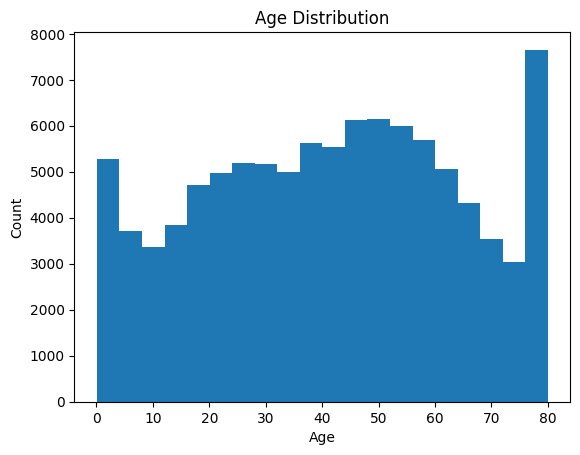
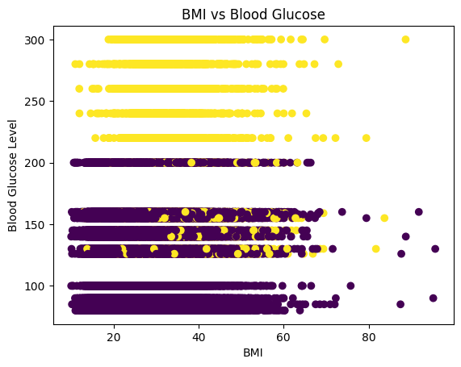
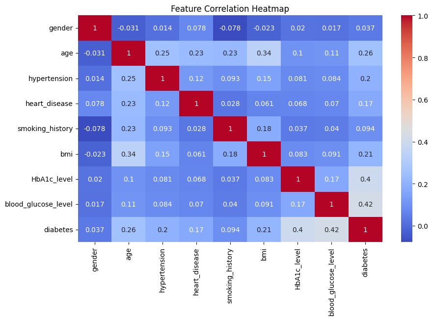
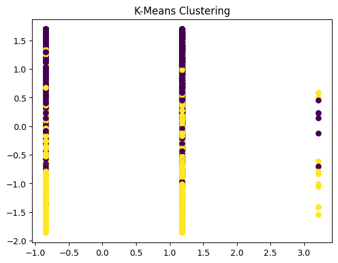

# Diabetes Prediction using Machine Learning

## Overview
This repository contains a machine learning project aimed at predicting diabetes based on various health metrics. The models in this project (such as K-Nearest Neighbors and Logistic Regression) were built **from scratch** to demonstrate a deep understanding of the underlying algorithms.

## Repository Contents
- **`Project.ipynb`**: The main Jupyter Notebook. It includes the entire pipeline: importing libraries, loading the data, preprocessing (Label Encoding, Scaling), exploratory data analysis (EDA), model training, and performance evaluation.
- **`uiu100k.csv`**: The dataset containing 100,000 patient records. Features include age, gender, smoking history, BMI, and blood glucose level.
- Dataset has been collected from https://www.kaggle.com/code/neerajsolath21071/diabetes-prediction

## Visualizations & Exploratory Data Analysis
As part of the analysis (the pictures outputted in the Jupyter Notebook run), several visualizations were generated to understand the data distribution and relationships:

### Age Distribution
A histogram showing the frequency of different age groups in the dataset.

### BMI vs. Blood Glucose Level
A scatter plot illustrating the relationship between BMI, Blood Glucose, and the presence of diabetes.

### Feature Correlation Heatmap
A Seaborn heatmap displaying how different features are correlated with one another, helping identify the most significant predictors of diabetes.

### Model Performance (Confusion Matrix)
Visualizing the performance of the machine learning models.

## Models Implemented
The following models were coded completely from scratch without fully relying on standard library implementations for their core algorithms:
- **K-Nearest Neighbors (KNN)**
- **Logistic Regression**

## Recall Improvement for Diabetes Detection
Because diabetes cases are the minority class in this dataset, the notebook now uses a recall-focused setup for Logistic Regression:
- **Stratified train/validation/test split** to preserve class balance across splits.
- **Class-weighted gradient updates** in scratch Logistic Regression to reduce false negatives.
- **Validation-based threshold tuning** (instead of a fixed 0.5 threshold) to target higher recall.

This improves the model’s ability to catch diabetic cases, which is critical when recall is the priority.

## Technologies Used
- **Python** base language
- **Pandas & NumPy** for data manipulation and mathematical operations
- **Matplotlib & Seaborn** for data visualization
- **Scikit-Learn** for data preprocessing (StandardScaler, LabelEncoder), train-test splitting, and evaluation metrics (Accuracy, F1-Score, ROC/AUC, etc.)
